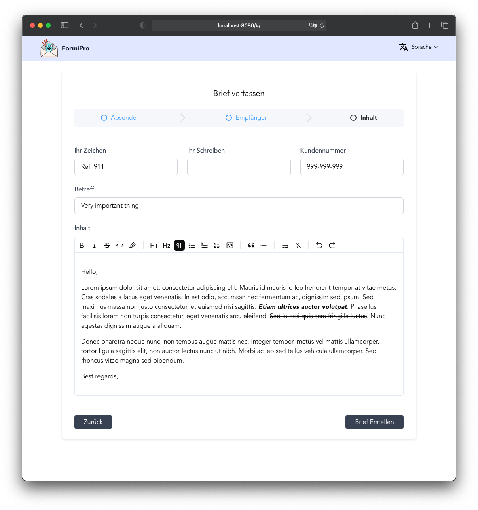
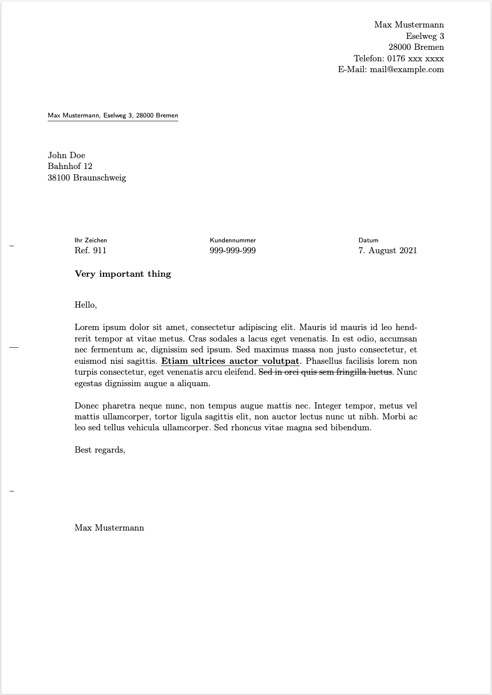

[](https://www.codacy.com/gh/quangnguyen/formipro/dashboard?utm_source=github.com&amp;utm_medium=referral&amp;utm_content=quangnguyen/formipro&amp;utm_campaign=Badge_Grade)

# formipro

EN - A tool for creating pdf letters in standard DIN A4.

DE - Ein Tool zum Erstellen von PDF-Briefen in Standard DIN A4.

## How to use

Start a docker container with following command:

```bash
docker run -p 22222:22222 -d nguyen99/formipro:latest
```

Open web browser with address http://localhost:22222 and go ahead.

## How to upgrade to new version

Pull latest version of formipro

```bash
docker pull nguyen99/formipro:latest
```





## Stack

  + Frontend (Not public for now)

    + Vue 3, Typescript
  
  + Backend

    + Golang, Latex
